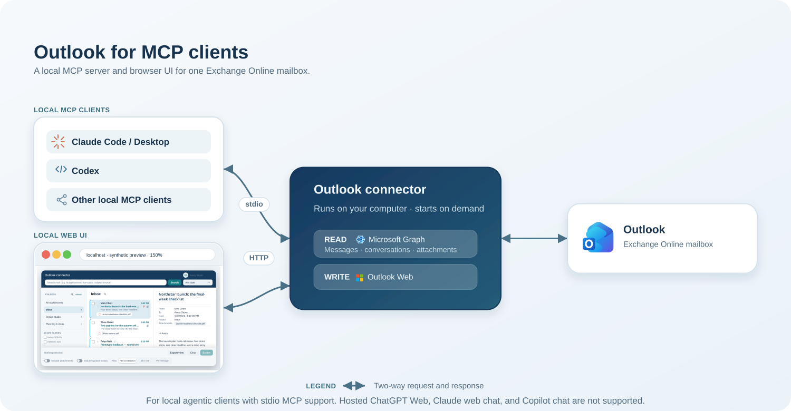
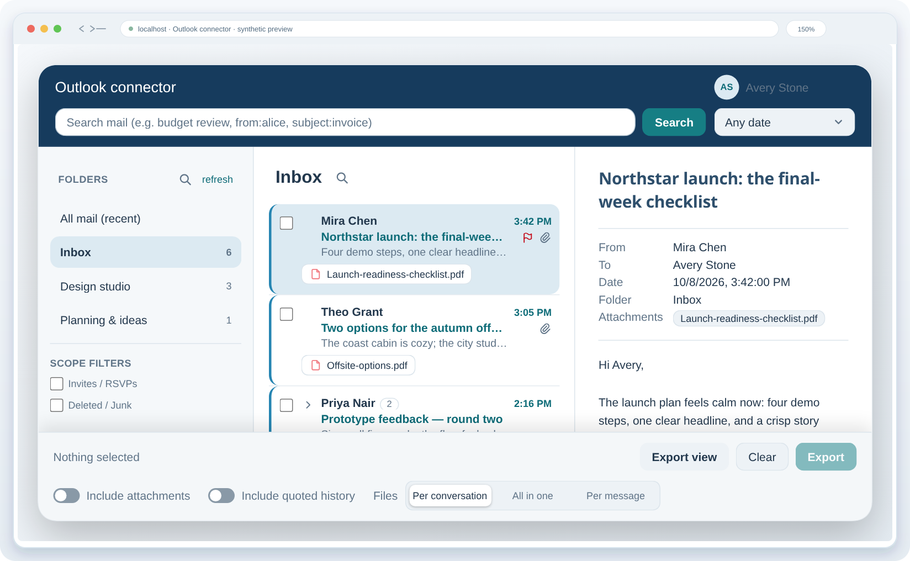

# Outlook connector

Connect your Outlook mailbox to local MCP clients and a small browser UI.

- Find messages by subject and contents, then read messages and full conversations.
- Export conversations, messages, or a folder/date window with attachments.
- Draft and send email, manage mailbox rules, and organize messages.
- Browse folders, read messages, and download attachments in the local UI.



## Setup

Python 3.12 or newer is required.

```bash
uv sync
uv run outlook-connector auth read
uv run outlook-connector auth write  # optional: drafts, sending, rules, signatures and mailbox changes
```

> Credentials are entered only on Microsoft's sign-in page. The application never sees them; tokens stay in the encrypted local cache.

For example, add the local stdio server to Claude Code with `uv run --directory /path/to/lrh-outlook-connector outlook-connector mcp`. Other local MCP clients use the same command in their stdio settings. ChatGPT does not connect directly to a local MCP server; it requires a remote MCP endpoint. OpenAI documents [Secure MCP Tunnel for supported products](https://help.openai.com/en/articles/12584461-developer-mode-and-full-mcp-connectors-in-chatgpt).

The UI opens in your browser and stops after 30 minutes without activity:

```bash
uv run outlook-connector ui
```



*Illustrative UI preview. All visible mailbox text is synthetic.*

## MCP tools

### Find and read

- `auth_status` — Check the local sign-in state and sign-in commands.
- `list_folders` — List reachable mail folders and their counts.
- `list_messages` — Read a page of recent messages; filter by folder, dates, and scope.
- `search_messages` — Search mail and group hits by conversation.
- `get_conversation` — Read a whole conversation across folders.
- `get_message` — Read one message body and its attachment metadata.

### Attachments and exports

- `list_attachments` — List a message's attachment metadata, including inline image IDs.
- `download_attachment` — Save an attachment locally; downloads are limited to 150 MB.
- `save_message_mime` — Save the original message as an `.eml` file.
- `export_messages` — Export conversations, messages, or a folder/date window as TXT or JSONL.

### Rules and signatures

- `list_rules` — Read inbox rules, including unsupported rules marked read-only.
- `create_rule` — Propose or confirm a supported inbox rule.
- `update_rule` — Propose or confirm edits to a supported inbox rule.
- `reorder_rules` — Propose or confirm the order of supported inbox rules.
- `delete_rule` — Propose or confirm deletion of a supported inbox rule.
- `list_signatures` — List native Outlook signatures and defaults.
- `get_signature` — Read one native signature's HTML and text.
- `create_signature` — Create a native Outlook signature.
- `update_signature` — Replace a native signature's contents.
- `delete_signature` — Delete a native Outlook signature.
- `set_default_signature` — Set or clear the new-message and reply defaults.

### Drafts and mailbox changes

- `create_draft` — Save a new message or reply as a draft.
- `send_draft` — Send an existing draft after an explicit user request.
- `set_read_state` — Mark selected messages or conversations read or unread.
- `set_flag` — Flag or unflag selected messages.
- `move_messages` — Move selected messages to a folder.
- `delete_messages` — Move selected messages to Deleted Items.

Rule writes first return a proposal; repeat the exact change only after a person approves it. Drafts are composed once, and send or mailbox writes are sent once. Deletes move items to Deleted Items; nothing is permanently deleted.

## Development

```bash
uv run ruff check .
uv run ruff format --check .
uv run pyright
uv run pytest
node --test tests/surfaces/message_reader.test.cjs
```

Project references: [requirements](docs/outlook-requirements-v4.md) · [architecture](docs/architecture.md) · [API research](docs/outlook-api-research.md) · [open roadmap](docs/outlook-roadmap.md).
