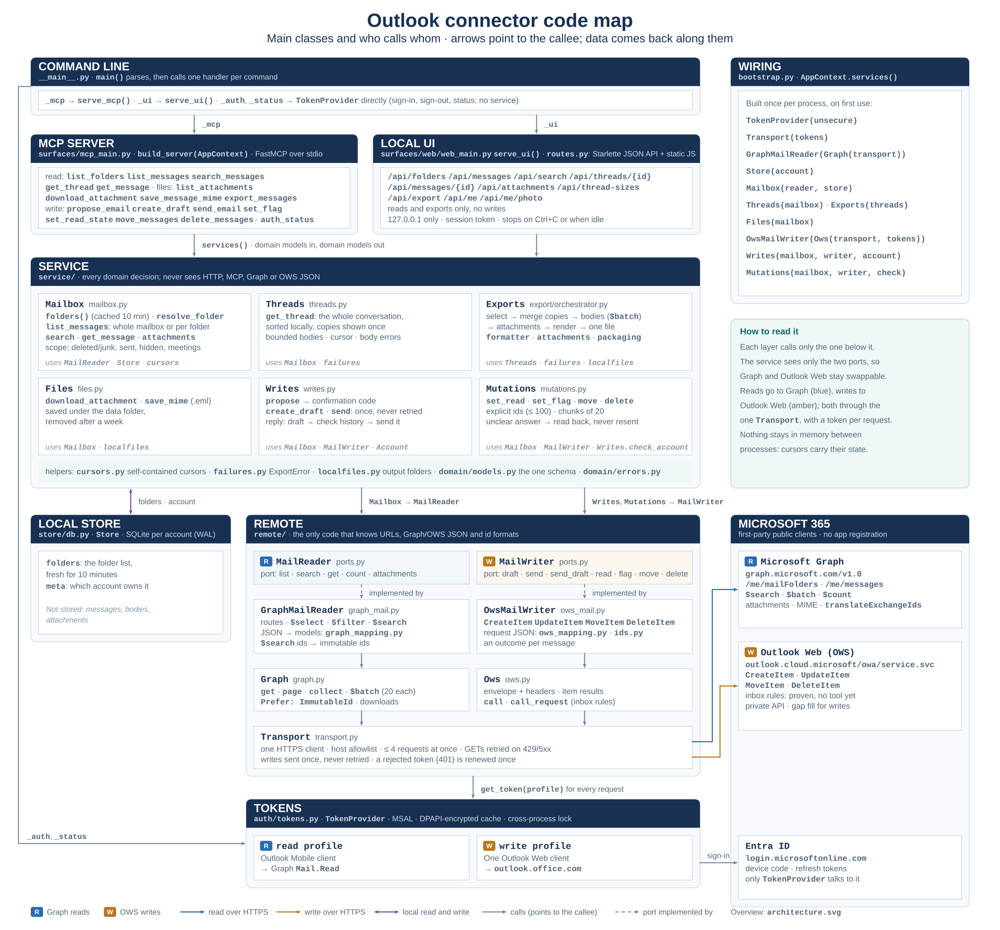

# Outlook Connector — Architecture

**Inputs:** [Requirements v4](outlook-requirements-v4.md) · [Roadmap](outlook-roadmap.md) · [API research](outlook-api-research.md)

The classes and who calls whom, in more detail: [code map](code-map.svg).

This document describes how the application is built: processes, layers, modules, data, and the main flows. *What* it must do is in v4. *Why* each API choice was made is in the research doc.

---

## 1. Principles

1. **Remote first.** Outlook's servers do the work: listing, filtering, search, conversation grouping. The app keeps locally only what the server cannot give back.
2. **No always-on service.** Every entry point is a short-lived local process started on demand, for one user. Several may run at once, and weeks may pass between runs. It is not designed to be hosted as a long-running MCP or HTTP server (§2).
3. **One domain implementation, thin surfaces.** The UI and MCP call the same service. Neither reimplements domain decisions.
4. **Protocol knowledge stays at the edge.** Only the [`remote/`](../src/outlook_connector/remote/) package knows URLs, Graph/OWS JSON, ID formats and paging. The service works with domain models.
5. **Documented first, gaps filled.** Use Graph for every capability it can serve. OWS (Outlook Web's private JSON RPC) fills only the gaps. The configured Graph profile serves mail reads; OWS fills the write capabilities unavailable to that profile. The split is tenant-specific and swappable (§6).
6. **Small modules.** Each responsibility gets its own module from the start. Do not grow a 2,000-line connector or service.
7. **Current format only.** Follow [AGENTS.md](../AGENTS.md): no migrations or compatibility shims. Development databases are reset, not migrated.

## 2. Process model

There is no daemon. Three entry points, all short-lived:

| Command | Lifetime | Started by | Loads |
|---|---|---|---|
| outlook-connector mcp | One process per MCP client session (stdio). Exits when the session ends. | Claude Code / Codex, from its MCP config | core + MCP |
| outlook-connector ui [--port] | Starts a localhost web server and opens the browser. Exits on Ctrl+C or after an idle timeout. | You, occasionally | core + web stack |
| outlook-connector auth [read\|write] [--unsecure] | One-shot device-code sign-in | You, rarely | core + auth |

outlook-connector status (offline) shows the signed-in account, which clients have tokens, and the store location.

Consequences of short-lived processes (see [AGENTS.md](../AGENTS.md)):

- **Nothing in memory is relied on across sessions.** A continuation travels in the result: cursors carry the remote link or per-folder positions and the original options.
- **Local caches are used only while fresh.** A process may start after days or weeks idle, so the cache it finds may be old. The folder cache is used while younger than 10 minutes and otherwise refreshed before the call continues.
- **No background work outlives a call:** no schedulers, sync loops or warm-up tasks. The UI's idle timer only stops the process.
- **Concurrent processes share the local files:** the store uses WAL and short transactions, the token cache a cross-process lock, output files an exclusive create.
- **Not a hosted service:** one user, localhost only (the UI binds 127.0.0.1 with a per-run session token), no multi-user auth or remote access.

**Consequences:**

- **Concurrency is cross-process.** Two agent sessions and the UI may run at the same time. The shared resources are the **token cache** (MSAL file cache with msal-extensions cross-process locking) and the **SQLite store** (WAL mode, busy_timeout, short write transactions, a connection per operation).
- **Startup cost matters**, because every agent session pays it.
  - Nothing runs at startup: no sync, no folder walk, no token refresh before the first call.
  - The web stack (Starlette, uvicorn) is imported only by ui, never by mcp.
  - Folders come from the cache while it is younger than 10 minutes; an older cache waits for a refresh (under a second). Messages are always listed from the server (no local message cache).
  - Each process builds its MSAL clients once and keeps access tokens in memory until shortly before expiry (rebuilding the client costs a network round trip).
- **No in-memory state outlives a call.** MCP continuation cursors are self-contained (they encode the remote nextLink or offset plus the original selection). They survive a client restart.
- **Exports run in the process that asked.** A UI export is one request that returns the file; an MCP export completes inside the tool call and returns a local file path. There is no background job queue and no progress reporting. An export holds at most 2,000 messages; it fetches bodies in bounded $batch rounds and finishes with per-message gaps marked rather than failing as a whole (§5.8).

## 3. Layers

The diagram at the top shows the layers, top to bottom:

1. **Surfaces** ([`surfaces/mcp_main.py`](../src/outlook_connector/surfaces/mcp_main.py), [`surfaces/web/`](../src/outlook_connector/surfaces/web/)) are thin adapters: parse, call, shape output.
2. The **service** ([`service/`](../src/outlook_connector/service/)) makes all domain decisions, using the models in [`domain/`](../src/outlook_connector/domain/).
3. The **remote** layer ([`remote/`](../src/outlook_connector/remote/)) and the **store** ([`store/`](../src/outlook_connector/store/)) sit underneath. Remote adapters implement the MailReader, MailWriter, RuleWriter and SignatureStore ports. The store is SQLite.
4. **Transport and tokens** ([`remote/transport.py`](../src/outlook_connector/remote/transport.py), [`auth/tokens.py`](../src/outlook_connector/auth/tokens.py)) are at the bottom.

**Rules:**

- Surfaces import [`service`](../src/outlook_connector/service/) and [`domain`](../src/outlook_connector/domain/) only.
- [`service`](../src/outlook_connector/service/) imports [`remote/ports.py`](../src/outlook_connector/remote/ports.py) (not concrete adapters), [`store`](../src/outlook_connector/store/) and [`domain`](../src/outlook_connector/domain/). It never sees raw Graph or OWS JSON. [`bootstrap.py`](../src/outlook_connector/bootstrap.py) wires the adapters.
- [`remote`](../src/outlook_connector/remote/) returns [`domain`](../src/outlook_connector/domain/) models. [`remote/graph_mapping.py`](../src/outlook_connector/remote/graph_mapping.py) is the only file that knows Graph field names.
- [`domain`](../src/outlook_connector/domain/) imports nothing from the app.

## 4. Repository layout

The application package is under [src/outlook_connector/](../src/outlook_connector/). Its entry points and composition live in [__main__.py](../src/outlook_connector/__main__.py), [`bootstrap.py`](../src/outlook_connector/bootstrap.py) and [`config.py`](../src/outlook_connector/config.py). Authentication is in [`auth/tokens.py`](../src/outlook_connector/auth/tokens.py); the remote adapters and ports are in [`remote/`](../src/outlook_connector/remote/); domain models are in [`domain/`](../src/outlook_connector/domain/); persistence is in [`store/`](../src/outlook_connector/store/); and domain operations are in [`service/`](../src/outlook_connector/service/).

The MCP surface is in [`surfaces/mcp_main.py`](../src/outlook_connector/surfaces/mcp_main.py), while the local browser UI is in [`surfaces/web/`](../src/outlook_connector/surfaces/web/) with its static files under [`surfaces/web/static/`](../src/outlook_connector/surfaces/web/static/). Synthetic test fixtures and tests are under [`tests/`](../tests/), with the fake mailbox in [`tests/fakes/graph_fake.py`](../tests/fakes/graph_fake.py). Dependencies and command entry points are declared in [`pyproject.toml`](../pyproject.toml).

## 5. Module responsibilities

### 5.1 [`auth/tokens.py`](../src/outlook_connector/auth/tokens.py)

- **One centralized provider** serving any number of named profiles (client_id + resource scope), all defined in [`config.py`](../src/outlook_connector/config.py). Cache, locking, fail-closed handling and the account check are shared. Profiles today (research §2):
  - read: Outlook Mobile 27922004-… → https://graph.microsoft.com/Mail.Read.
  - write: One Outlook Web 9199bf20-… → https://outlook.office.com/.default.
- One MSAL PublicClientApplication per profile per process; the access token is kept in memory until 5 minutes before expiry. Silent acquisition first. Device code only from the auth command, so surfaces never start an interactive sign-in. They raise AuthenticationRequired with the exact command to run.
- Encrypted cache via msal-extensions by default, **fail-closed** when unavailable. --unsecure selects a separate, clearly named plaintext cache file in the same data directory, with a warning on every use. Every process finds it at the same path, wherever it was started.
- Cross-process lock around cache reads and writes.
- The account fingerprint (tid+oid) must match the store owner (§7).
- The write profile is optional. Read-only use works without it, and write tools report "write sign-in required".
- The recorded AADSTS65002 client/scope pairs (config.DENIED_PAIRS) are never requested; a unit test checks the profiles against them.

### 5.2 [`remote/transport.py`](../src/outlook_connector/remote/transport.py)

- One httpx.AsyncClient per process. It keeps connections alive within a call.
- [`remote/urls.py`](../src/outlook_connector/remote/urls.py) is the sole outbound URL policy: it owns the HTTPS host allowlist and keeps Graph continuation links under the versioned Graph root. No redirects. Sign-in traffic to login.microsoftonline.com goes through MSAL, not this client.
- Response size caps. Downloads (attachments, MIME) stream.
- One auth/retry state machine handles ordinary requests and streamed downloads. Retries are limited to idempotent requests: GETs, and read-style POSTs the caller marks idempotent ($batch of GETs). They honor 429 / Retry-After. Writes (write=True) are sent once: an answer that never completes, or a 5xx, raises WriteOutcomeUnknown (the write may have happened); a 4xx or 429 is a definite failure. A 401 still renews the token once, since nothing was processed.
- At most **4 requests in flight** per process: Exchange Online allows about 4 concurrent requests per app and mailbox (and 10,000 per 10 minutes).
- **401** (token rejected: revoked, or a continuous-access-evaluation challenge): the token is renewed once (force_refresh, or the claims challenge from WWW-Authenticate) and the request retried; a second 401 raises AuthenticationRequired with the sign-in command. **403** is "access denied" for that item and never asks for a new sign-in.
- Maps HTTP and Graph/OWS errors to domain errors. An error names the operation in progress (operation() context, e.g. "While fetching message bodies"), the HTTP status, the service error code and a shortened message, and the request-id. Throttling errors state the limits. Logs metadata only.

### 5.3 [`remote/ids.py`](../src/outlook_connector/remote/ids.py)

- Graph immutable REST id → OWS ItemId: swap the base64 alphabet (-→/, _→+). The same applies to conversationId. The synthetic mailbox uses these same conversion helpers; live evidence is in [API research §4.2](outlook-api-research.md).
- This is the only place that converts IDs; the synthetic mailbox calls these helpers too.

### 5.4 [`remote/graph.py`](../src/outlook_connector/remote/graph.py), [`graph_mail.py`](../src/outlook_connector/remote/graph_mail.py), [`graph_mapping.py`](../src/outlook_connector/remote/graph_mapping.py)

**[`graph.py`](../src/outlook_connector/remote/graph.py):**
- Sends Prefer: IdType="ImmutableId" on every call.
- Follows nextLink safely, keeping it on the Graph host.
- Batches with **$batch**, up to 20 sub-requests per call. Used to hydrate conversations and exports, count conversation sizes and list attachments, instead of N sequential GETs. Rules:
  - batch request ids are numbers assigned per batch and mapped back. Graph compares them case-insensitively, and immutable ids can differ only by case;
  - at most 2 batches in flight per process, shared by all concurrent callers (each sub-request counts against the mailbox's concurrency limit);
  - throttled or temporarily failing sub-requests (429/502/503/504, the statuses single reads retry) are re-sent in new batches of at most 20 after the advised Retry-After, for up to 4 rounds; an item that still fails keeps its last status;
  - results are per item: what is still throttled or failed is returned to the caller, which reports it per message instead of failing the whole call.

**[`graph_mail.py`](../src/outlook_connector/remote/graph_mail.py)** implements MailReader. Operations:
- list_folders() with hidden folders included (the service needs them to tell what is out of reach). The folder cache is refreshed from the complete folder tree.
- list_messages(folder | mailbox, since, until, page_size, page, skip): skip starts a folder listing past its newest messages (per-folder listing, below).
- get_message(id, body_format) and get_messages(ids) (batched; per-item failures returned).
- conversation(conversation_id), which returns all folders, leaves sorting to the caller ($orderby is rejected with this filter) and reports truncation past 1,000 messages.
- conversation_folders(conversation_ids): batched (folder, Internet message id) per message of each conversation, for counts.
- count_messages(folder_ids, window): the server's per-folder count and newest received date in the window in one $batch request ($count, ConsistencyLevel: eventual). A folder whose sub-request fails is left out of the answer, so one failure (e.g. a folder deleted since the folder list was read) never hides the other counts. The server total needs every in-scope folder counted. A first-page include_total reuses these counts when all in-scope folders were counted; otherwise it issues a separate count request. The per-folder listing chooses an uncounted folder by its cached total and claims the excluded count only when every excluded folder was counted.
- search(query): $search, field-scoped queries passed through. $search returns regular ids, so each page's ids are converted with one POST /me/translateExchangeIds call into the immutable ids every other call uses (if that call fails, the page keeps its search ids rather than failing).
- list_attachments(id) and list_attachments_many(ids) (batched) select and map the typed fileAttachment contentId directly; there is no per-image lookup.
- download_attachment(id, att_id) and download_mime(id) stream to a file. They are retried like other GETs (429/503 after Retry-After, gateway errors, a connection that fails or drops mid-download), each time from scratch; what still fails is a domain error (Upstream with no status for a lost connection), so an export marks that one attachment instead of failing. Raw attachment and message MIME downloads stop at the connector's local 150 MB guard; exports classify an oversized attachment and direct the user to Outlook.
- Every operation is named for error messages ("While listing attachments: …").

**[`graph_mapping.py`](../src/outlook_connector/remote/graph_mapping.py):** maps every Graph shape to [`domain/models.py`](../src/outlook_connector/domain/models.py). Unknown fields are ignored. Missing optional fields become None.

### 5.5 [`remote/ows.py`](../src/outlook_connector/remote/ows.py), [`ows_mail.py`](../src/outlook_connector/remote/ows_mail.py), [`ows_mapping.py`](../src/outlook_connector/remote/ows_mapping.py)

- Split like the Graph side (§5.4): [`ows.py`](../src/outlook_connector/remote/ows.py) is the client (Ows), [`ows_mapping.py`](../src/outlook_connector/remote/ows_mapping.py) builds request bodies (pure functions), [`ows_mail.py`](../src/outlook_connector/remote/ows_mail.py) holds OwsMailWriter.
- OwsMailWriter implements MailWriter. This is a gap fill (§6), replaceable by a Graph writer where Graph mail write scopes are available.
- The bearer-only OWS envelope and write contracts are described in [API research §4.1–4.2](outlook-api-research.md). Payloads ≤ 2,048 characters go in the X-OWA-UrlPostData header. Anchor mailbox, correlation headers.
- Ows.call(action, body) sends one action and returns its item results; an item whose ResponseClass is not Success/Warning raises an error naming its ResponseCode. The anchor mailbox is the write token's upn.
- Ows.call_request(action, fields) sends the inbox-rule actions, which use a second style (research §4.4): the request object itself, no JsonRequest wrapper and no Body; the answer's WasSuccessful / ErrorCode decide success, and an answer without them is an unknown outcome. Same URL and headers, sent once. Used by OwsRules through the RuleWriter port.
- Actions:
  - create_draft (CreateItem with SaveOnly, into Drafts; replies use EWS's ReplyToItem / ReplyAllToItem with explicit recipients and subject and an HTML body, so the quoted original keeps its formatting and inline images; returns the draft id, mapped to Graph's alphabet);
  - send_draft (UpdateItem with SendAndSaveCopy and no field updates on an existing draft, its ItemId carrying the change key the draft was read at, NeverOverwrite; SendItem is not supported over OWS);
  - set_read / set_flag (UpdateItem, one SetItemField per message, read receipts suppressed);
  - move (MoveItem; a well-known target by DistinguishedFolderId, any other folder by FolderId);
  - delete (DeleteItem with MoveToDeletedItems; there is **no hard delete**).
  Conversation read state is done per message with UpdateItem (all copies in scope), so ApplyConversationAction is not used.
- Native signature images resolved by the service are included as CID-linked inline file attachments
  in both new-message and reply CreateItem bodies.

- Mutations return an outcome per message (None, or Outlook's ResponseCode). Never retries.

### 5.6 [`remote/cloud_settings.py`](../src/outlook_connector/remote/cloud_settings.py)

- CloudSettings implements the SignatureStore port for Outlook native roaming signatures. It uses
  the encrypted, account-bound write profile and Cloud Settings endpoint; it does not use browser
  credentials or store a local copy.
- Reads fetch the name list and both defaults fresh. Each signature content read verifies its scope
  matches the current list setting. Writes use one PATCH or DELETE request and are never retried.
  The opaque account scope is carried from present settings into writes. Missing list/default records mean no names/defaults; malformed or duplicate records and mismatched scopes still fail. An empty response permits listing and unsigned drafts, but signature writes require a scope returned by Outlook; configure a signature in Outlook first if none is returned.
- Signature data-image sources must be quoted and match the inline conversion format; unsupported forms are rejected before any write.
- Names are exact and case-sensitive. Commas are refused because the server exposes the list as a
  comma-joined value; names are URL-encoded for content reads. Content updates do not rename, and
  deletion does not repair a selected default.

### 5.7 [`domain/models.py`](../src/outlook_connector/domain/models.py) and [`domain/errors.py`](../src/outlook_connector/domain/errors.py)

- Pydantic models: Folder, Recipient, MessageSummary (with also_in for merged copies, and meeting on meeting mail: kind, start, end, location, out of date; read from Graph's eventMessage fields in the same listing, so no extra requests), Message, Attachment, Coverage (with excluded counts per ExclusionReason: deleted_or_junk, outgoing), MessagePage (with cursor), ConversationHit (with message_count) + SearchResult, MessageContent, ConversationMessage + Conversation, ConversationSize, ExportRequest, ExportArtifact. Drafts add OutgoingMessage (explicit text/HTML, reply context and signature selection), private DraftMessage (including inline images), DraftResult and SendResult. Signature tools return SignatureList, SignatureDetails and SignatureWriteResult; mutations add ItemResult and MutationResult.
- MessageSummary exposes one received_at value: Graph receive time, with send time as fallback. It has no parallel sent-time field.
- Failure is the structured per-item failure value for batch reads.
- Output models serialize optional fields only when set (no nulls, no empty lists): MCP results stay small, and a missing field means its default. Required fields are always present.
- These models are the schema source for MCP (FastMCP derives tool input/output schemas from them) and for the web JSON API. No hand-written schemas.
- ExportError (step, status, code, message, request id, likely cause, retry, fix) describes a gap in an export or conversation body.
- Errors: AuthenticationRequired, AccountMismatch, NotFound, InvalidRequest, Throttled, Upstream, WriteOutcomeUnknown. Each surface maps them to its own protocol. A transport error carries Microsoft's answer as a Failure (status, code, shortened message, request id), which batch results also report per item.

### 5.8 [`store/`](../src/outlook_connector/store/)

- One SQLite database per account fingerprint under the user data directory. WAL mode, busy_timeout, a connection per operation, short transactions.
- Holds only the account binding (owner fingerprint) and the **folder cache** (id, parent, alias, counts, and a TTL timestamp).
- No message data at all: no summaries, bodies, attachment bytes or mailbox mirror (research §3.2). Mail deleted on the server is not retained locally. Message data is read from Microsoft Graph only.
- When the owner fingerprint does not match, the existing database is left untouched and a separate one is used.

### 5.9 [`service/`](../src/outlook_connector/service/)

- Numeric input bounds are validated once at service entry points, shared by MCP and web. MCP schemas describe those bounds without enforcing a second range.
- Conversation expansion for exports and read-state changes runs in groups of four, using the shared request cap from [`remote/ports.py`](../src/outlook_connector/remote/ports.py) and [`remote/transport.py`](../src/outlook_connector/remote/transport.py).

**[`mailbox.py`](../src/outlook_connector/service/mailbox.py):**
- list_folders and every scope decision use the folder cache only while it is younger than 10 minutes (whichever process saved it; within a long process the map is reloaded at the same age). An older or empty cache, or refresh=true, waits for Graph, whose folder levels are fetched in parallel (under a second). One refresh at a time per process; concurrent unknown-folder lookups recheck under the lock and share the refresh.
- **Scope rules, shared by list, search, conversations, sizes and export:** each refreshed folder map derives each folder's category once from itself and its parents, then reuses those categories for the call: hidden (also Sync Issues) > deleted_or_junk > outgoing. Deleted Items and Junk Email (with their subfolders; a folder deleted in Outlook sits inside Deleted Items) are left out unless scope.deleted_items (a folder named in the request is always included); Sent Items, Drafts and Outbox are left out when scope.sent_items is false; list, search and folder/date-window exports also leave out meeting mail (invitations, RSVPs, cancellations; excluded.meeting_mail) when scope.meeting_mail is false, per message, so a conversation that is only meeting traffic disappears and one with real replies shows through them. For exports, all scope keys apply to folder/date-window selections; conversations keep sent/meeting mail but follow scope.deleted_items, and explicit message ids are authoritative. True shows more mail and false filters more where scope applies; coverage.excluded counts what was left out, per reason. A non-default scope key that an operation cannot apply is rejected. Export accepts scope alongside any selection and applies it according to those rules.
- **Out of reach:** hidden folders, and items whose folder is not among the mail folders (e.g. Teams meeting records in SkypeSpacesData/TeamsMeetings), are always dropped (excluded.hidden): from lists, search, conversations, conversation sizes, totals and folder/date-window/conversation exports. list_folders omits hidden folders and naming one is refused. An unknown folder id first refreshes the folder list once (a folder created meanwhile is found); ids still unknown are remembered as outside and never refresh again. Sync Issues and its subfolders (classic Outlook's conflict and failure copies) are out of reach too, recognized by their well-known names since Graph does not always mark them hidden. **Copies** of one message (same Internet message id: mail sent to yourself or to a list you are on) are shown once, keeping a received copy; also_in names the other folders.
- list_messages(selection, scope, include_total, detail) fetches from remote and returns MessagePage + Coverage. A mailbox-wide scope (no folder) is listed one of two ways, chosen on every first page: when the folders the scope leaves out (Junk Email, Deleted Items and their subfolders, hidden folders, and Sent Items, Drafts and Outbox with scope.sent_items=false) hold at least two thirds of the mailbox's messages (PER_FOLDER_SHARE, from the cached folder counts, no request), it lists **folder by folder**: one $count batch picks the in-scope folders with mail in the window, first reads are sized by each folder's share of the requested page; every eligible folder gets a current head read before the merge chooses messages; eventual count dates are not ordering bounds, and missing counts fall back to cached weights (folders that need more are read in parallel, within the transport's limit of 4), and the merge returns the newest limit. The same count batch also counts the window's Deleted Items and Junk (with subfolders), reported in coverage.excluded on the first page only (continuation pages do not repeat the full-window count); an excluded count is reported only when every excluded folder was counted. The cursor carries each folder's position (offsets, folder id → messages returned), plus the scope object with its current keys; coverage.notes says the listing was per folder and why. Otherwise it lists /me/messages and the folder filters apply after paging, so a filtered page can hold fewer than limit messages; a page that the filters empty entirely is skipped (bounded). Both return the same messages in the same order; a cursor keeps the method its first page chose. Folder views (a named folder) are always one listing. include_total adds server_total (copies counted separately; meeting mail included even when scope.meeting_mail=false hides it, and a coverage note says so). detail=compact (the MCP default) drops recipients, categories and Internet ids.
- get_message(id, offset, max_chars, body) returns a bounded body with continuation; max_chars=None returns the whole body (the local web reader: one server read, where chunks would each re-read the message). An unreadable id is NotFound, worded without guessing the cause (deleted, moved out of reach, or a wrong id).
- search(query, since?, until?, folder?, scope, detail) runs Graph $search and groups hits by conversationId, each hit with the conversation's message_count. since/until are normalized once here for every caller (naive dates are UTC, aware dates converted to UTC) before the window and the cursor are built. KQL only takes dates, so the query asks for a day more on each side and results are then filtered to the exact since/until.
- conversation_sizes(conversation_ids, scope) counts each conversation the way get_conversation lists it (copies once); only scope.deleted_items affects its result. The UI and search hits use it.

**[`conversations.py`](../src/outlook_connector/service/conversations.py):**
- get_conversation(conversation_id, scope):
  1. fetch the conversation from remote;
  2. **sort locally**, oldest first;
  3. hydrate bodies via $batch when requested; a body-fetch failure is represented by that
     message's export_error field, so callers count markers from the message list.

- bodies() returns a body or an ExportError for every message (still throttled, access denied, deleted meanwhile); the text shows the [EXPORT ERROR] block ([`failures.py`](../src/outlook_connector/service/failures.py)) in place of the body.

**[`failures.py`](../src/outlook_connector/service/failures.py):**
- One classification of failed Microsoft requests for exports and conversations: export_error(step, failure) turns the remote layer's Failure (status, code, shortened message, request id; status None = no response) into an ExportError with the likely cause, retry and the fix: 429/503 throttled (retry), other 5xx or no response service or network (retry), 403 access denied, 404 deleted or moved during the export, anything else unexpected (report it with the request id). error_from separately classifies the known local 150 MB attachment download limit and recommends downloading that attachment directly from Outlook.
- describe is the one detail formatter for structured remote failures and ExportError. error_block renders the TXT block used by exports and get_conversation (which also returns the ExportError itself); error_summary writes the export header's one "Export errors: …" line.

**[`writes.py`](../src/outlook_connector/service/writes.py):**
- create_draft validates explicit text/HTML, recipients, subject and reply context; text becomes
  escaped minimal HTML preserving whitespace and NBSP. Intentional HTML passes through, with only
  active web content refused. The private writer takes DraftMessage, always HTML.
- [`service/signatures.py`](../src/outlook_connector/service/signatures.py) validates exact names and passive HTML; commas are not allowed in names. It checks
  write-profile account ownership, freshly reads native settings and contents, and refuses
  missing/unreadable defaults or a configuration that changes during a read. It does not cache
  settings or emulate the organization's recipient-dependent add-in. create_draft resolves the
  correct default or explicit name, adds one signature block after the body, converts data-URI images
  into CID-linked inline attachments, and verifies the saved image bytes on Graph read-back.
  include_signature=false skips signature lookup entirely.
- Drafts are composed once. A change creates a full replacement and verifies its read-back before the
  old draft is moved to Deleted Items; the new id replaces the old one. Never delete first. Changes
  in Outlook and attachments added there are not carried over. There is no version check against
  the old draft; read it first if needed. Every change recreates the draft.
- create_draft requires bounded Graph read-back and returns DraftResult: id, saved/failed, full
  server text/HTML, message metadata and simple findings. Reply creation retains full quoted-history verification, reusing the original and draft data already fetched while checking original HTML structure and inline images.
- send_draft(id) requires an existing draft and the bound write account, and sends once with
  UpdateItem / SendAndSaveCopy and no field updates, bound to the draft's change key as read
  (NeverOverwrite): a draft changed since then is refused with nothing sent (see [API research §4.2](outlook-api-research.md)). It accepts no content arguments and never
  reconstructs mail. An ambiguous answer reads the exact immutable id: a Sent Items copy proves sent,
  otherwise unknown. Human approval is the host/agent interaction, not a connector token.

**[`service/rules.py`](../src/outlook_connector/service/rules.py) / [`remote/ows_rules.py`](../src/outlook_connector/remote/ows_rules.py):**
- Service depends on RuleWriter; only OwsRules knows rule wire fields and identity envelopes.
- Supported From/Sent to and subject/subject-or-body conditions, Move to folder and Stop processing.
  Non-neutral unsupported fields (including exceptions) mark a rule read-only; its complete server
  revision is retained as a hash for confirmation binding. No unsupported rule is updated or deleted.
  Neutral: description metadata (DescriptionTimeFormat/TimeZone) and each inactive condition's
  exact "not set" value (NullImportance, NullSensitivity, NullInboxRuleMessageFlag,
  NullInboxRuleMessageType, per field), which OWS reports on every rule; any other value is active.
- NewInboxRule can report an identity that fresh GetInboxRule does not, so creation takes the id
  of the one new rule in read-back that matches the request.
- Each write first returns a stateless proposal with a RULE code bound to account, normalized request
  and every current rule revision. Confirmation re-reads state and refuses changed proposals.
- One OWS write follows confirmation and is always read back. No automatic write retry. Failed
  read-back or ambiguous unverified outcomes return unknown; a mismatched successful write returns failed.
- Toggles are separate from field edits to keep each confirmation to one OWS call. Reordering
  includes every supported rule in the requested order, preserves enabled flags and is refused when
  unsupported rules exist. No local rule cache/proposal registry.
- OWS reads target folder names/references rather than Graph ids; folder write targets resolve through
  Mailbox. Target read-back compares the reported folder name; duplicated names cannot prove exact identity.

**[`mutations.py`](../src/outlook_connector/service/mutations.py):**
- set_read (also per conversation: every message in scope, all copies), set_flag, move(folder) and delete act on **explicit ids only**, at most 100 per call, checked at each entry point before anything is read. The write sign-in must be the bound account.
- Concurrent conversation reads are bounded to four; a failing expansion cancels and awaits sibling reads before returning the original error. Conversations given to set_read expand without that limit, up to the 1,000 messages the server lists per conversation; notes names a conversation cut there. When the selection has more than 100 messages, counts covers all of it and results keeps only explicit ids and messages that did not end done or unchanged.
- Flow: conversation expansion reuses its returned summaries; explicit ids read current state through Graph (get_summaries, one $batch): unknown ids → not_found, hidden or outside the mail folders → failed, already as wanted → unchanged (nothing sent). Then send in chunks of 20, with a status per message (done, not_found, failed with the code). On WriteOutcomeUnknown, read the chunk back: done where the change is visible, unknown elsewhere.
- Categories are read and returned with each message; no tool changes them.
- move resolves the target like list_folders (hidden folders refused) and refuses Deleted Items. delete moves to Deleted Items and leaves messages already in Deleted Items (or its subfolders) alone, since deleting there again would take them out of the folder view.
- All four accept continue_on_error=true by default. Clear chunk failures become per-message
  failed results; ambiguous outcomes are read back and remain unknown if that read fails. With false,
  any unresolved/error result in a sent chunk stops subsequent chunks: failed, not sent. Earlier
  done/unchanged results and counts always survive; no write is retried.

**[`service/files.py`](../src/outlook_connector/service/files.py):**
- Attachment downloads use the message's attachment metadata. Saving MIME downloads the message once and derives the .eml filename from the downloaded Subject header.

**export/:**
- [`orchestrator.py`](../src/outlook_connector/service/export/orchestrator.py) resolves a selection: conversations, individual messages and/or a folder/date window (since, until, folder, narrowed by scope), paged through list_messages with the same rules, then merges copies once across the whole selection; per-source reads defer copy merging to this final pass. Conversation expansion runs in batches of four; a failing read cancels and awaits sibling reads before returning the original error. Scope does not select anything; it narrows folder/date-window selections, and scope.deleted_items also applies to conversations while explicit message ids remain authoritative. Scope alone is refused with the error "Select conversations, messages, a folder, or a date window (since/until)." The window is paged with skip_returned_copies=False, so copies on different pages reach that merge and also_in names every folder. The selection is refused above limit (at most 2,000 logical messages) with its deduplicated count; raw copies remain available until the final merge preserves their folder labels. Messages selected by id are authoritative, like get_message(id): they are exported wherever Graph can read them (hidden folders and Sync Issues included) and only labeled and merged with the rest, while conversations keep sent/meeting mail but follow scope.deleted_items and folder/date windows follow all scope rules. They are read from the server in $batch; if any cannot be read, the export fails before writing anything: NotFound when they are gone, Throttled when any is still throttled after the batch retries, Upstream otherwise, with their count, the first few ids and their case, and what to do. It then hydrates through $batch (reusing bodies fetched while selecting), formats, attaches and packages, and returns an ExportArtifact with messages_excluded, unavailable_message_ids, export_errors (failures per step) and error_summary (the header's "Export errors" line). A body, attachment download or attachment listing that fails during the export becomes an ExportError marked in the file; the export still completes.
- [`formatter.py`](../src/outlook_connector/service/export/formatter.py) renders **TXT** (for people): a header (counts, date span, what was left out, and the "Export errors" summary), then per-message headers with the message, conversation and internet ids, Also in: for merged copies, uniqueBody by default and full optional, plus attachment lines and [EXPORT ERROR] blocks for what failed; people are separated by ;  (display names are often "Last, First"). Or **JSONL** (format=jsonl, for agents): one record per message with ids, dates, folder, also_in, people, the body (or body: null and an export_error object), attachment records (with the file path inside the ZIP when attachments are included, or their own export_error), and attachments_export_error when the attachments could not be listed.
- [`attachments.py`](../src/outlook_connector/service/export/attachments.py) applies the attachment policy:
  - non-inline attachments by default;
  - inline images when the rendered body references their cid:; if content id or rendered body is unavailable, include rather than silently drop;
  - itemAttachment → .eml;
  - sanitized, deduplicated names; identical files (same bytes, e.g. a signature logo on every message) are stored once per output file, and every message points to that file;
  - a failed download becomes an [EXPORT ERROR] block ("The attachment <name> could not be downloaded.") and an export_error on its JSONL record. If it exceeds the 150 MB connector limit, the error says to download it directly from Outlook.
- [`packaging.py`](../src/outlook_connector/service/export/packaging.py) decides the output: one flat .txt only when the result is a single TXT with no attachment files, otherwise one .zip (TXTs at the root, <stem>/ folders for attachments). The file is created exclusively in the exports directory (a numbered suffix on a name clash, so concurrent exports never overwrite each other).

### 5.10 [`surfaces/`](../src/outlook_connector/surfaces/)

**[`mcp_main.py`](../src/outlook_connector/surfaces/mcp_main.py):**
- FastMCP over stdio. Each tool is a few lines: validate, call the service, return a model.
- Bounded responses with self-contained cursors.
- Attachments, MIME and export artifacts are returned as local file paths, never inline base64.
- Server instructions explain the scope object, what is out of reach (hidden folders, non-mail items; search is mail only), merged copies, coverage and cursors, scope.sent_items=false for "latest mail", include_total, the export options (format=jsonl for analysis), Graph's throttling limits (no parallel tool calls; prefer one folder/date-window export), the 150 MB attachment download limit, and that "access denied" is not a sign-in problem. With send, they will also repeat the send-authorization rule.
- List and search results are compact by default (detail="full" for every field). Message dates have one received_at value.

**web/:**
- Starlette JSON API over the same service calls. UI port and idle timeout defaults come from [`surfaces/ui_settings.py`](../src/outlook_connector/surfaces/ui_settings.py). It also provides POST /api/export (one download; an X-Export-Errors header carries the "Export errors" line when something could not be exported, and the UI shows it) and POST /api/heartbeat (keeps the idle timer alive while a tab is open).
- [`index.html`](../src/outlook_connector/surfaces/web/static/index.html) + [`app.js`](../src/outlook_connector/surfaces/web/static/app.js) provide:
  - Outlook-style rows: sender, subject and preview; unread rows with a blue bar and blue subject; Outlook dates ("Fri 9:31 AM"); flag and paperclip icons; file chips under messages with attachments (names fetched after the list loads, one batched POST /api/attachments per 200 messages; a chip downloads its file); meeting mail labelled (Invite, Updated, Canceled, Accepted, Tentative, Declined) with its time and place, a conversation showing its current invitation. The whole row is clickable; colors follow Outlook's light and dark themes;
  - a conversation-grouped list that opens on the Inbox. After a list loads, the UI asks for each conversation's real size: one-message conversations are plain rows, conversations show an accurate count. An expanded conversation spans all folders and shows the newest message on top; merged copies carry an "also in" badge, and search matches are marked;
  - an "Invites / RSVPs" switch in the list header, off by default (meeting mail hidden), applied to the list, search and "export this view";
  - a "Deleted / Junk" switch in the list header, applied to the list, search, counts, expansion and exports (always on inside those folders and their subfolders), and "export this view" (the current folder and date window). The folder list shows only reachable folders;
  - a reader that shows the whole chosen body in one request (no size cap; an answer for a message no longer selected is ignored), with attachment download buttons;
  - your display name and profile photo in the header (Graph /me and /me/photos/48x48/$value, read once per process and kept in memory; initials when no photo is set);
  - a folder picker and a "recent, all mail" view;
  - an online search box;
  - an in-memory filter;
  - selection checkboxes;
  - Ctrl+click (Cmd+click on a Mac) on a row toggles its selection instead of opening it;
  - export options: switches for attachments and quoted history (one quoted-history setting for the reader and exports), and a segmented control for how files are split (per conversation, all in one, per message).
- Binds to localhost only.

## 6. Capability routing and portability

Graph serves mail reads with the read profile. OWS serves drafts, sending, rules and mailbox mutations with the write profile. The Cloud Settings adapter serves native roaming signatures with the write profile. The adapters are swappable behind the ports in [`remote/ports.py`](../src/outlook_connector/remote/ports.py); capability evidence and limitations are recorded in [API research §2](outlook-api-research.md).

| Capability | Adapter | Token profile |
|---|---|---|
| Folders, messages, conversations, search, attachments and MIME | [GraphMailReader](../src/outlook_connector/remote/graph_mail.py) | read |
| Drafts, send, rules and mailbox changes | [OwsMailWriter](../src/outlook_connector/remote/ows_mail.py) and [OwsRules](../src/outlook_connector/remote/ows_rules.py) | write |
| Native roaming signatures | [CloudSettings](../src/outlook_connector/remote/cloud_settings.py) | write |

### 6.1 How the code stays swappable

- **Ports.** [`remote/ports.py`](../src/outlook_connector/remote/ports.py) defines MailReader (folders, messages, conversations, search, attachments
  and MIME), MailWriter (drafts, sends and mailbox changes) and SignatureStore (native signature
  settings and contents). The service depends only on these ports, never on a concrete backend.
- **Adapters.** [`remote/graph_mail.py`](../src/outlook_connector/remote/graph_mail.py) implements MailReader; [`remote/ows_mail.py`](../src/outlook_connector/remote/ows_mail.py) implements MailWriter;
  [`remote/cloud_settings.py`](../src/outlook_connector/remote/cloud_settings.py) implements SignatureStore. Each adapter keeps its wire format in the [`remote/`](../src/outlook_connector/remote/) layer.
- **Wiring.** [`bootstrap.py`](../src/outlook_connector/bootstrap.py) picks one adapter per port, and one token profile per adapter, from [`config.py`](../src/outlook_connector/config.py). There is exactly one implementation per port at runtime. No dual backends and no automatic cross-backend fallback (a write must never be retried through a second backend).

### 6.2 Adapting to another tenant or a policy change

Re-run the relevant probes from [research/README.md](../research/README.md), record the result in the research log, and update the configured profiles and adapters to match the capabilities that are available. Keep the service dependent on the ports in [`remote/ports.py`](../src/outlook_connector/remote/ports.py); select adapters in [`bootstrap.py`](../src/outlook_connector/bootstrap.py). A write uses one backend per capability and is never retried through a second backend.

The domain, service, store and surface boundaries remain independent of Graph and OWS wire formats.

## 7. Data and identity

- **Account fingerprint:** a hash of tid + oid. It selects the database and must match both token profiles.
- **Item key:** the Graph immutable id, within the account's own store. Immutable ids survive moves within the mailbox.
- **Conversation key:** Graph conversationId.
- **Locations:**
  - data directory: %USERPROFILE%/.lrh-outlook-connector on Windows, $XDG_DATA_HOME/lrh-outlook-connector (or ~/.local/share/...) elsewhere. The Windows default is under the user profile so packaged desktop clients, local MCP servers and terminal-launched commands share the same tokens, store and exports;
  - token cache: <data directory>/token-cache.bin (encrypted), or token-cache.plaintext-dev.json with --unsecure;
  - OUTLOOK_CONNECTOR_HOME overrides the data directory (tests, portability);
  - store: <data directory>/accounts/<fingerprint>/mail.sqlite3 (account binding and folder cache only);
  - exports and downloaded attachments: <data directory>/exports/, removed after 7 days. Attachment downloads during an export use an OS temp directory, removed when the export is packaged.

## 8. Surfaces: tools and endpoints

| MCP tool | Service module | Behavior |
|---|---|---|
| `auth_status` | [`auth/tokens.py`](../src/outlook_connector/auth/tokens.py) | Read local sign-in status |
| `list_folders` | [`service/mailbox.py`](../src/outlook_connector/service/mailbox.py) | List reachable folders and counts |
| `list_messages` | [`service/mailbox.py`](../src/outlook_connector/service/mailbox.py) | List messages in a folder or mailbox, with folder, date-window and scope filters |
| `search_messages` | [`service/mailbox.py`](../src/outlook_connector/service/mailbox.py) | Search messages with folder, date-window and scope filters |
| `get_conversation` | [`service/conversations.py`](../src/outlook_connector/service/conversations.py) | Read a conversation using the requested scope |
| `get_message` | [`service/mailbox.py`](../src/outlook_connector/service/mailbox.py) | Read a message body |
| `list_attachments` | [`service/files.py`](../src/outlook_connector/service/files.py) | List attachment metadata, including inline image IDs |
| `download_attachment` | [`service/files.py`](../src/outlook_connector/service/files.py) | Save an attachment locally |
| `save_message_mime` | [`service/files.py`](../src/outlook_connector/service/files.py) | Save the original message as an .eml file |
| `export_messages` | [`service/export/`](../src/outlook_connector/service/export/) | Export conversations, messages or a folder/date window |
| `list_rules`, `create_rule`, `update_rule`, `reorder_rules`, `delete_rule` | [`service/rules.py`](../src/outlook_connector/service/rules.py) | Read rules or propose and confirm supported changes |
| `list_signatures`, `get_signature`, `create_signature`, `update_signature`, `delete_signature`, `set_default_signature` | [`service/signatures.py`](../src/outlook_connector/service/signatures.py) | Read and manage native Outlook signatures |
| `create_draft`, `send_draft` | [`service/writes.py`](../src/outlook_connector/service/writes.py) | Create drafts and send an existing draft |
| `set_read_state`, `set_flag`, `move_messages`, `delete_messages` | [`service/mutations.py`](../src/outlook_connector/service/mutations.py) | Change read state, flags and message locations |

Web endpoints expose the same read operations through the local UI, plus attachment downloads, conversation-size lookups, exports, status, profile details and a heartbeat. The web surface is implemented in [`surfaces/web/`](../src/outlook_connector/surfaces/web/); every API call requires the per-run session token and a localhost Host header. Write tools are MCP-first.

## 9. Cross-cutting concerns

| Concern | Rule |
|---|---|
| Logging | Operation, status, counts, durations, backend. Never subjects, bodies, addresses, query text, tokens, cookies or ids in clear (logged URL paths show {id} instead of ids). |
| Retries | Idempotent requests only, bounded, honoring Retry-After. Throttled $batch items are re-sent in batches of at most 20. Writes never retry. An ambiguous write → re-read state. |
| Throttling | Exchange Online: about 4 concurrent requests and 10,000 requests per 10 minutes per app and mailbox; each $batch item counts. At most 4 requests and 2 batches in flight per process. Clients are told the limits (MCP instructions, error messages). |
| Bounds | Every list/search/conversation/body response is size-bounded with a cursor. Binary content goes through resources or files. |
| Errors | Domain errors from the service, naming the operation, service code/message and request id. 401 → renew once, then AuthenticationRequired; 403 → access denied (no new sign-in). The MCP surface returns tool errors, the web surface returns HTTP status + JSON. Bulk operations report per-item gaps instead of failing whole. |
| Security | Localhost-only web binding. Host allowlist for outbound calls. No arbitrary URL fetching. No browser credentials, ever. |

## 10. Tooling

- **uv** for the environment, with a committed [`uv.lock`](../uv.lock) (uv sync). pip works too (pip install -e . --group dev). The outlook-connector console script comes from [`pyproject.toml`](../pyproject.toml).
- **ruff** for lint and format, **pyright** (standard mode) for types: uv run ruff check ., uv run ruff format --check ., uv run pyright, uv run pytest.
- **pytest** with **httpx.MockTransport** fakes serving synthetic Graph/OWS payloads. Fixtures are never derived from real captures.
- The research probes in [`research/`](../research/) stay stdlib and separate, and are excluded from pytest and pyright. They are for discovering APIs, not for testing the app.

## 11. Current choices

| Area | Current choice |
|---|---|
| Authentication | MSAL with an encrypted, fail-closed token cache. --unsecure uses a separate plaintext development cache. |
| Package and CLI | Python package outlook_connector; command outlook-connector. |
